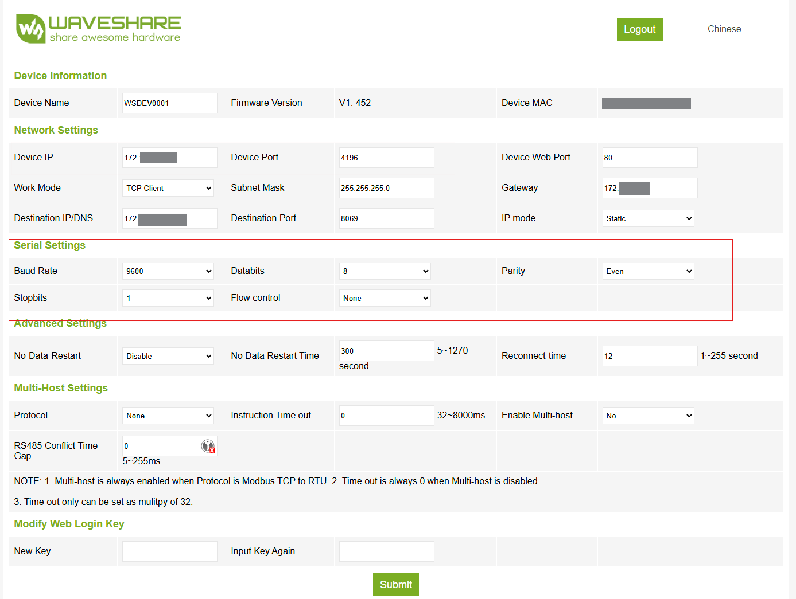

# EHS Sentinel Home Assistant Integration

This custom integration connects your Samsung EHS Sentinel system to Home Assistant, enabling real-time monitoring and control.

## Features

- Seamless integration with Home Assistant
- Auto-discovery of sensors, switches, numbers, selects, and binary sensors
- Asynchronous communication for fast updates
- Configuration via Home Assistant UI

## Recommended Hardware

Here a list of Rs485 to ETH Adapters which has been tested:
 - [Waveshare RS485 to RJ45 Ethernet Converter Module with POE](https://amzn.to/44KtGaU)

## Hardware Settings
User the IP from Device IP and Port from Device Port to Configure the Integration.
See that all Settinmgs from Baud Rate, Databits, parity, Stopbits are similar to those:

## Installation

1. **Add this repository to HACS:**
   - Go to HACS > Integrations > ⋮ (menu) > Custom repositories
   - Add the repository URL: `https://github.com/echoDaveD/ehs_sentinel_hacs_integration`
   - Select category: Integration

2. **Install the integration:**
   - Search for "EHS Sentinel" in HACS > Integrations
   - Click "Install"

3. **Restart Home Assistant**

4. **Configure the integration:**
   - Go to Settings > Devices & Services > Add Integration
   - Search for "EHS Sentinel" and follow the setup instructions

## Configuration Options

- `ip`: IP of RS485 to ETH Adapter
- `port`: PORT of RS485 to ETH Adapter
- `polling`: Switch if Sentinel should poll some measurements
- `write-mode`: Switch if Entities of Sentinel are writable or only read only

## Support

For issues or feature requests, please open an issue on [GitHub](https://github.com/echoDaveD/ehs_sentinel_hacs_integration/issues).

---