# 🌡️ EHS Sentinel – Home Assistant Integration

> 🔗 Connect your **Samsung EHS Sentinel** system to **Home Assistant**  
> 📡 Real-time monitoring & control via RS485 (F1/F2)  
> ⚡ Fast, asynchronous communication  
> 🧩 Fully UI configurable  

---

## ❤️ Support the Project

If this integration helps you and you’d like to support further development, you can donate via PayPal:

<p align="center">
  <a href="https://www.paypal.com/donate?hosted_button_id=S2TUVZPX2MQ6Q">
    
  </a>
</p>

Your support helps maintaining, improving and extending this integration 🙌

---

# ✨ Features

✅ Seamless Home Assistant integration  
🔍 Auto-discovery of:

- Sensors  
- Switches  
- Numbers  
- Selects  
- Binary Sensors  

⚡ Fully asynchronous communication  
🧠 Smart state updates  
🛠 Configuration via Home Assistant UI  
🧩 Multi-device support (multiple EHS systems in parallel)  
🧾 FSV Export / Import functionality  
📨 Direct NASA message bus interaction  

---

# 🔌 Recommended Hardware

Tested RS485 → Ethernet adapters:

For a Wi-Fi-based setup, you can use the M5Stack Atomic RS485 Base (SP3485EEE) paired with an M5Stack Atom Lite ESP32. This configuration requires an ESP-to-WiFi server. I recommend using ESPHome Web or the ESPHome Builder (via Home Assistant) to deploy the esphome-stream-server onto the device. A sample configuration file for ESPHome is available here: [ehs-bridge.yaml](ressources/ehs-bridge.yaml).

## 🥇 Recommended

**Waveshare RS485 to RJ45 Ethernet Converter Module with PoE**  
https://amzn.to/44KtGaU  

## ⚠️ Alternative

**Elfin EW11**  
_(Some users reported issues with writing/polling)_

---

# ⚙️ Hardware Configuration

Use:

- **Device IP → `ip`**
- **Device Port → `port`**

Make sure these settings match:

- Baud Rate  
- Data Bits  
- Parity  
- Stop Bits  

## Waveshare Example

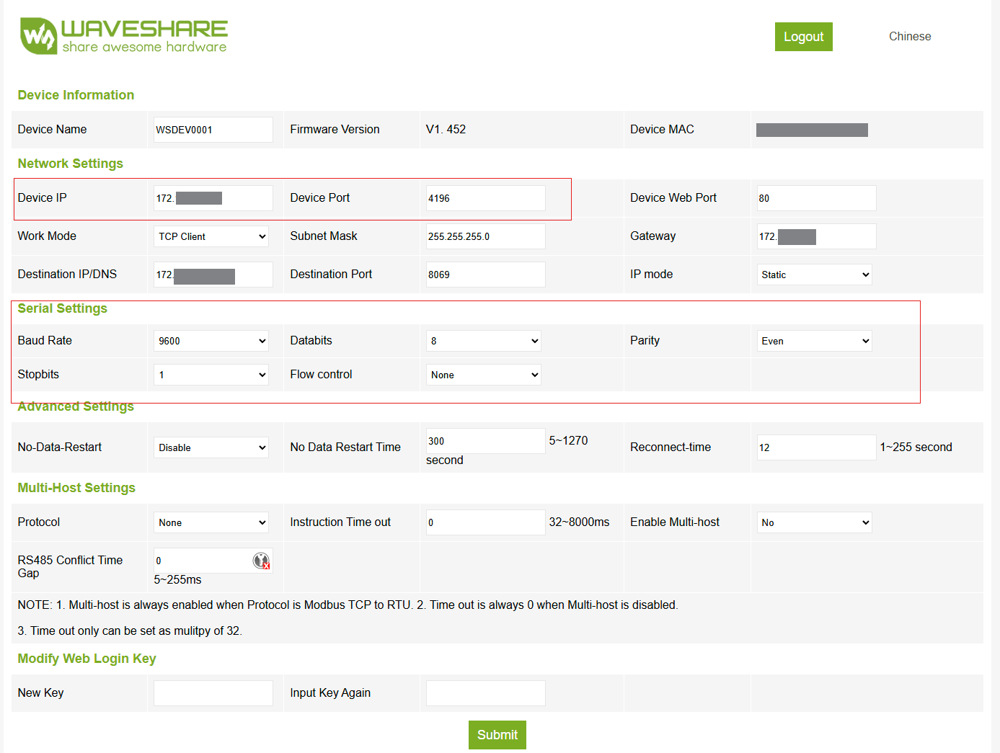

## Alternative Waveshare Firmware

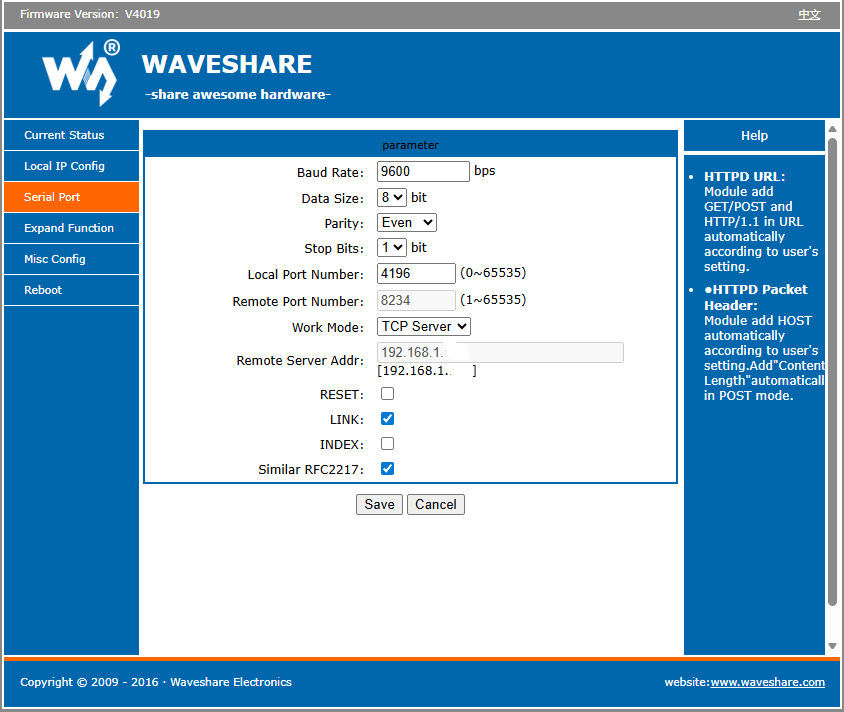

## Elfin Example

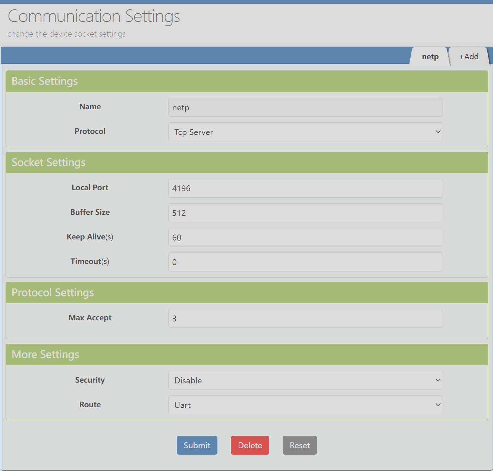

---

# 🔌 F1 / F2 RS485 Connection

📚 Documentation source:  
https://wiki.myehs.eu/wiki/F1/F2_connector  

F1/F2 is the **RS485 interface** of the EHS system.

## Connection Mapping

```text
F1 → RS485 A  
F2 → RS485 B
```

## ⚠️ Important: RS485 Topology

All RS485 devices must be connected **linearly**:

- Main PCB  
- Wi-Fi Kit  
- RS485 Adapter  

## Hardware Locations

### Main PCB

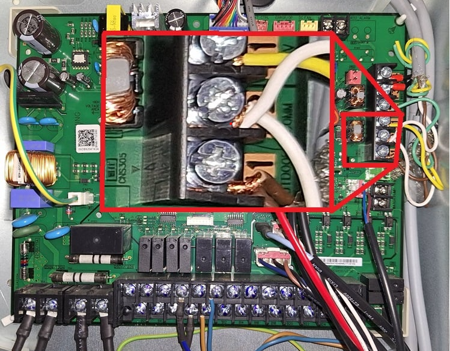

### Wi-Fi Kit

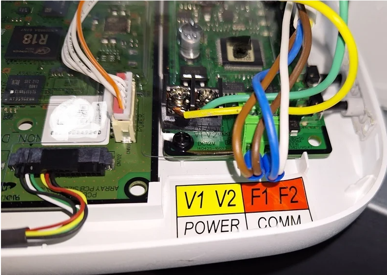

### RS485 Adapter Wiring

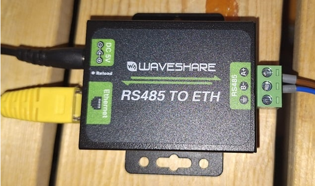

---

# 🚀 Installation

## 1️⃣ Add Repository to HACS

- Go to **HACS → Integrations → ⋮ → Custom repositories**
- Add:

```text
https://github.com/echoDaveD/ehs_sentinel_hacs_integration
```

- Category: **Integration**

---

## 2️⃣ Install Integration

- Search for **"EHS Sentinel"**
- Click **Install**

---

## 3️⃣ Restart Home Assistant

---

## 4️⃣ Add Integration

- Go to **Settings → Devices & Services → Add Integration**
- Search for **EHS Sentinel**
- Follow setup instructions

### Multi-Device Setup

You can add the integration multiple times to control multiple Samsung EHS systems in one Home Assistant instance.

- Add one config entry per EHS system
- Use the correct `ip` and `port` for each RS485 adapter
- Assign a unique integration name for each entry (for clear device/entity grouping)
- Repeat until all systems are added

---

# ⚙️ Configuration Options

| Option | Description |
|--------|------------|
| `ip` | IP of RS485 adapter |
| `port` | Port of RS485 adapter |
| `polling` | Enable polling of measurements |
| `write-mode` | Enable writable entities |
| `extended_logging` | Log all NASA packets (except heartbeats) |
| `indoor-channel` | Middle byte of Indoor address |
| `indoor-address` | Last byte of Indoor address |
| `force_refresh` | Force entity update on every read (may affect performance) |

---

# 🛰 Service Actions

This integration provides powerful custom Home Assistant services.

---

## 📨 Send Message

Send custom NASA messages to devices.

Key names:

```text
custom_components/ehs_sentinel/data/nasa_repository.yml
```

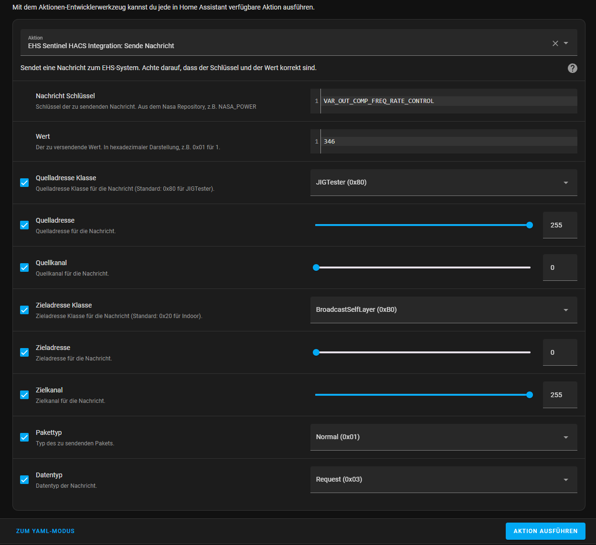

---

## 📥 Request Message

Request values from connected devices.

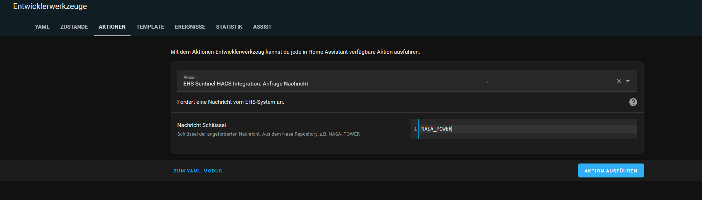

---

## 📤 Export FSV Settings

Exports FSV settings to YAML.

Saved to:

```text
www/ehs_sentinel/logs
```

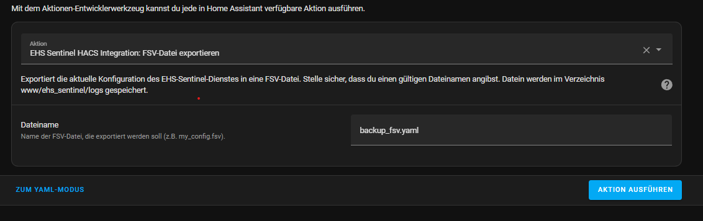

---

## 📥 Import FSV Settings

Restores previously exported FSV settings.

- Only changed values are written  
- Messages are sent individually  
- Confirmation required per message  

Import is complete once the response panel appears:

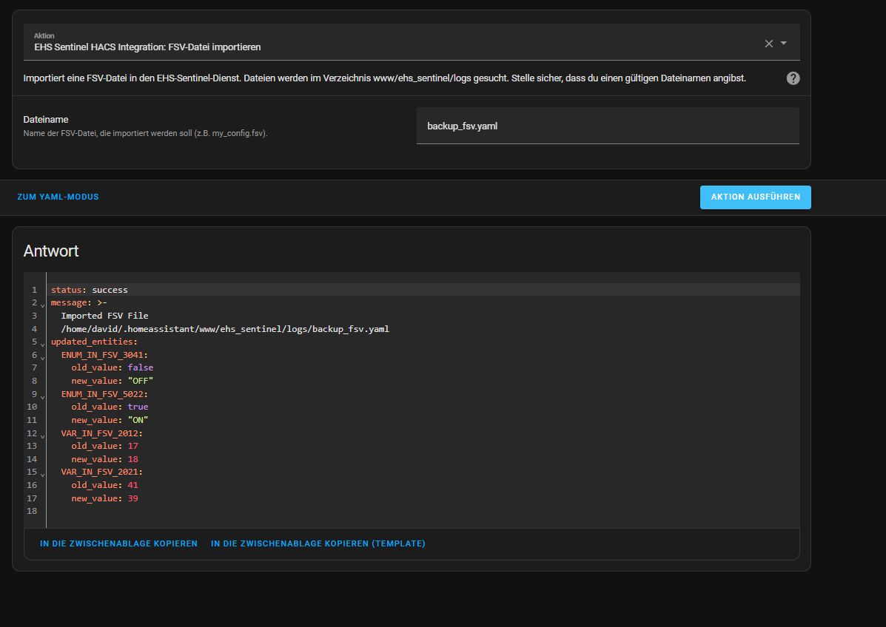

---

# 🖥 Home Assistant Dashboard Templates

Two basic dashboard templates are included:

- 🟢 **Read Only Mode**
- 🎛 **Control Mode**

Insert the YAML under:

> Dashboard → Raw Configuration

## Templates

- `ressources/dashboard_readonly_template.yaml`
- `ressources/dashboard_controlmode_template.yaml`

---

## 📊 Read Only Mode

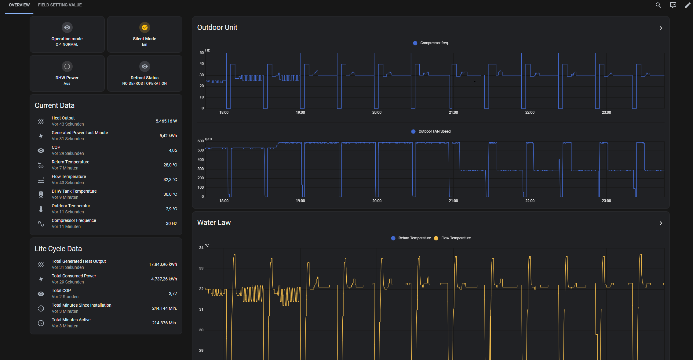  
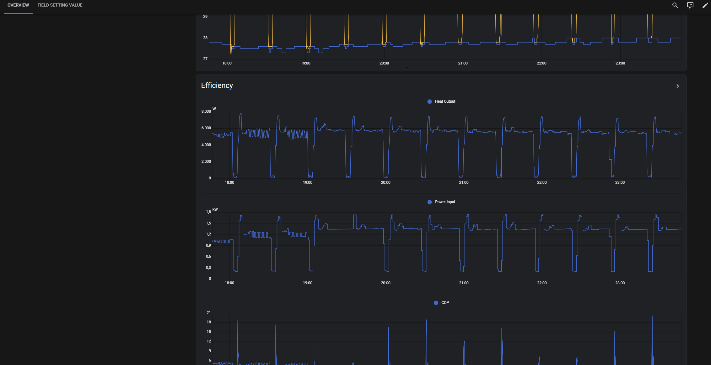  
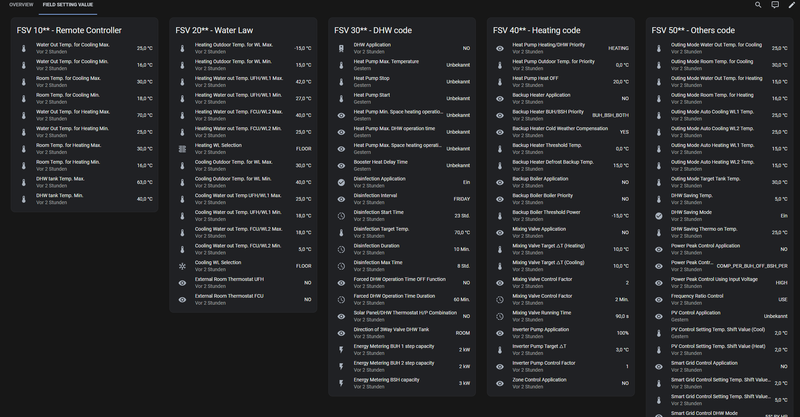

---

## 🎛 Control Mode

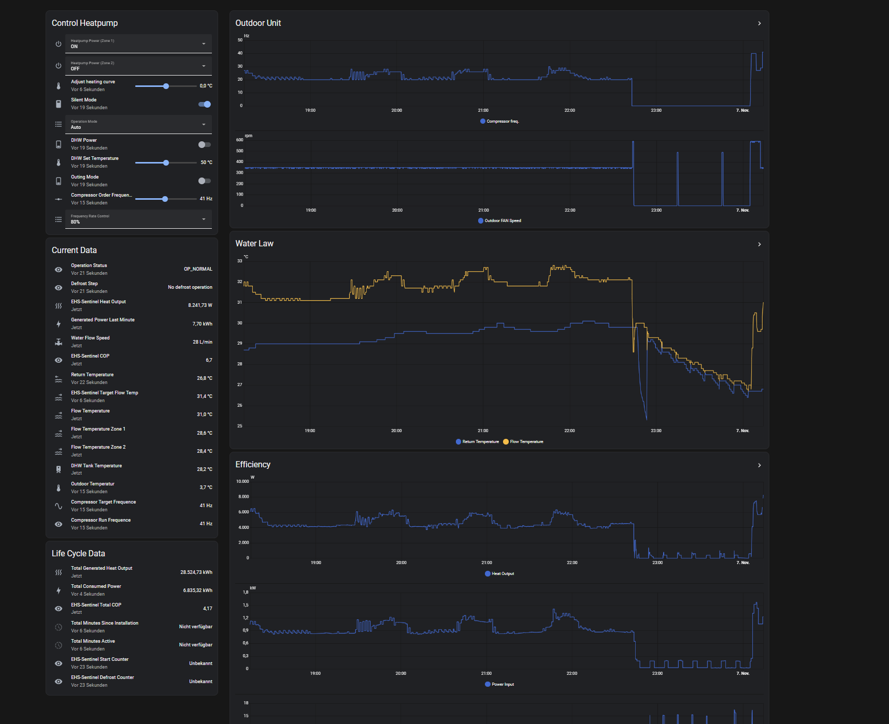  
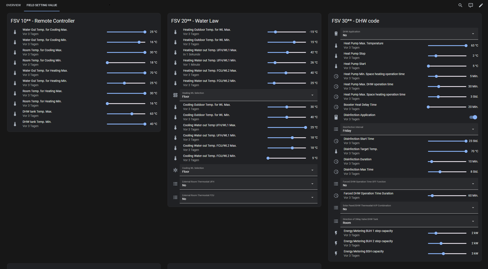  
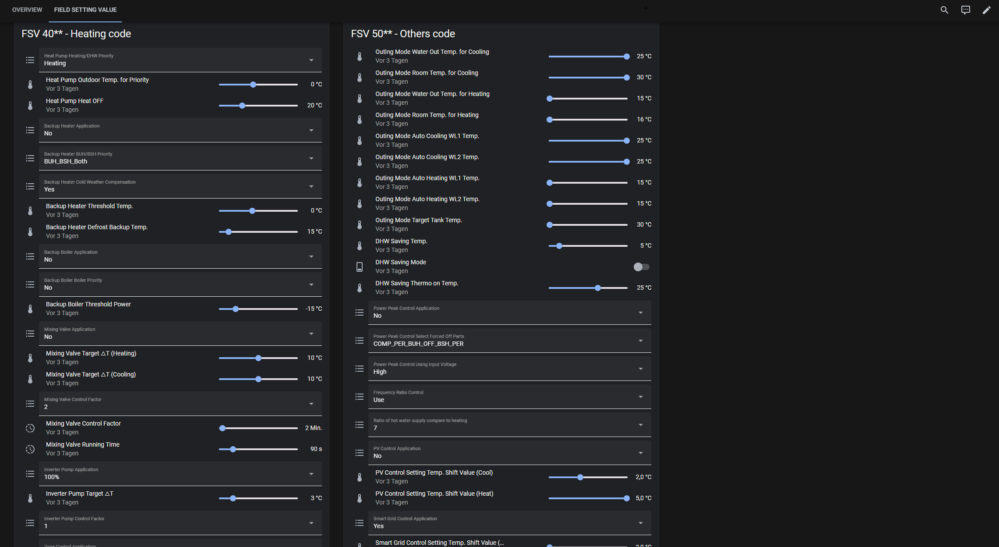

---

# 🛟 Support & Issues

Found a bug?  
Have an idea?

👉 https://github.com/echoDaveD/ehs_sentinel_hacs_integration/issues  

---

# 🙌 Contributions Welcome

Pull requests, feature ideas and feedback are always welcome!

Let’s make Samsung EHS + Home Assistant even better 🚀