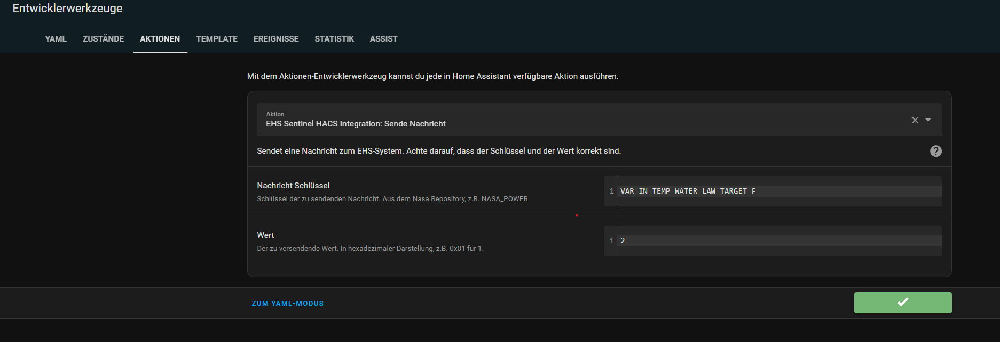
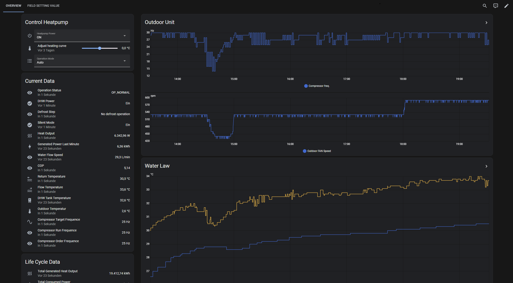

# EHS Sentinel Home Assistant Integration

This custom integration connects your Samsung EHS Sentinel system to Home Assistant, enabling real-time monitoring and control.

## Support the Project

If you like this integration and want to support further development, you can donate via PayPal:

## Features

- Seamless integration with Home Assistant
- Auto-discovery of sensors, switches, numbers, selects, and binary sensors
- Asynchronous communication for fast updates
- Configuration via Home Assistant UI

## Recommended Hardware

Here a list of Rs485 to ETH Adapters which has been tested:
 - [Waveshare RS485 to RJ45 Ethernet Converter Module with POE](https://amzn.to/44KtGaU)
 - Elfin EW11

## Hardware Settings
User the IP from Device IP and Port from Device Port to Configure the Integration.
See that all Settinmgs from Baud Rate, Databits, parity, Stopbits are similar to those:

## Installation

1. **Add this repository to HACS:**
   - Go to HACS > Integrations > ⋮ (menu) > Custom repositories
   - Add the repository URL: `https://github.com/echoDaveD/ehs_sentinel_hacs_integration`
   - Select category: Integration

2. **Install the integration:**
   - Search for "EHS Sentinel" in HACS > Integrations
   - Click "Install"

3. **Restart Home Assistant**

4. **Configure the integration:**
   - Go to Settings > Devices & Services > Add Integration
   - Search for "EHS Sentinel" and follow the setup instructions

## Configuration Options

- `ip`: IP of RS485 to ETH Adapter
- `port`: PORT of RS485 to ETH Adapter
- `polling`: Switch if Sentinel should poll some measurements
- `write-mode`: Switch if Entities of Sentinel are writable or only read only
- `extended_logging`: Switch if extended logging should be turned on or off. If On Sentinel is Logging all Packets except from IndoorUnit, OutdoorUnit and WifiKit HeartBeats
- `indoor-channel`: Indoor Channel (the middle byte of the Indoor Address)
- `indoor-address`: Indoor Address (the last byte of the Indoor Address)
- `force_refresh`: Force a refresh of entities on every read (may impact performance). If set to true, the entities will be refreshed on every read from NASA Protokoll. If False(Default) only on status change

## Service Actions

This integration provides two custom Home Assistant services to interact with the NASA message bus used by the EHS Sentinel system. These services allow you to send or request values from connected devices using predefined NASA signal keys.
For Key names look at [custom_components/ehs_sentinel/data/nasa_repository.yml](custom_components/ehs_sentinel/data/nasa_repository.yml)

# Home Assistant Dashboard

There are two rudimentary dashboard templates for Homeassistant.

Insert this yaml under "Raw Configration" for an Dashboard.

Read Only [ressources/dashboard_readonly_template.yaml](ressources/dashboard_readonly_template.yaml)

Control mode [ressources/dashboard_controlmode_template.yaml](ressources/dashboard_controlmode_template.yaml)

If you have good ideas and want to extend this feel free to create an issue or pull request, thanks!

## Read Only Mode

## Control Mode

## Support

For issues or feature requests, please open an issue on [GitHub](https://github.com/echoDaveD/ehs_sentinel_hacs_integration/issues).

---